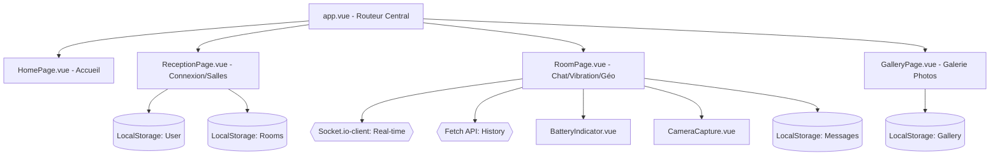

# Structure et Architecture du Projet

Ce document détaille l'organisation du code et l'architecture technique de l'application PWA M1TP1.

## Architecture Globale

L'application est construite avec **Nuxt 4** et utilise une architecture de composants Vue.js 3 avec l'API de Composition.

### Diagramme des Composants & Flux de Données

## Organisation des Dossiers

| Dossier | Description |
| :--- | :--- |
| `app/` | Contient le cœur de l'application. |
| `app/components/` | Composants principaux (ReceptionPage, RoomPage, etc.). |
| `app/assets/css/` | Styles Vanilla CSS organisés par composant. |
| `public/` | Assets statiques (icônes, manifestations). |
| `tests/` | Tests automatisés (Vitest). |

---

*Ce document fait partie de la documentation technique du projet.*
