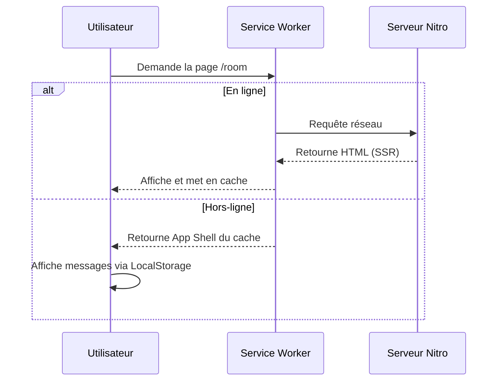

# Stratégies de Rendu (SSR, SSG, ISR)

Ce document analyse les méthodes de rendu appliquées dans ce projet Nuxt 4.

## 1. Comparaison des Modes

| Mode | Statut dans le projet | Intérêt |
| :--- | :--- | :--- |
| **SSR** | Actif (Nitro) | Rendu initial rapide et SEO optimisé. |
| **SSG** | Partiel (Assets) | Performance maximale pour les pages statiques. |
| **ISR** | Non requis | Utile pour les blogs ou catalogues massifs. |
| **CSR/PWA** | Actif (App Shell) | Interactivité et mode hors-ligne. |

## 2. Exemples concrets du projet

- **SSR (Server-Side Rendering)** : Le fichier `ReceptionPage.vue` est partiellement rendu côté serveur pour afficher la liste des salons dès le premier chargement.
- **CSR (Client-Side Rendering)** : `RoomPage.vue` gère les messages temps-réel via Socket.io uniquement côté client après le chargement initial.
- **Mode Offline** : En mode hors-ligne, le Service Worker prend le relais pour servir le contenu mis en cache, simulant une application native.

## 3. Comportement du Service Worker

